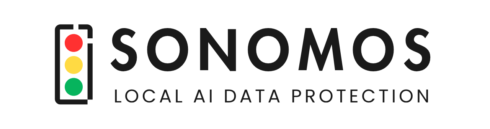

<p align="center">
  
</p>

<p align="center">
  <strong>Your data should never leave your machine unprotected.</strong>
</p>

<p align="center">
  <a href="https://sonomos.ai"></a>
  <a href="https://docs.sonomos.ai"></a>
  <a href="https://linkedin.com/company/sonomos"></a>
  <a href="mailto:info@sonomos.ai"></a>
</p>

---

We build local-first privacy infrastructure for AI. Our tools detect and mask sensitive data — credit cards, SSNs, API keys, medical records, names, addresses — before it reaches any AI model. Everything runs on your device. Nothing leaves your machine unscreened.

### The problem

Every prompt is a potential data leak. Developers paste code with API keys. Users share documents with client names. Teams discuss strategy with internal numbers. The AI sees everything. There is no undo.

### Our approach

We intercept at every surface where data meets AI — browsers, desktops, MCP tool calls, agent workflows — and apply detection and masking locally, before transmission. No cloud. No server-side scanning. No trust required.

---

## Public Projects

### [Canary](https://github.com/sonomos-ai/Canary) — PII exposure counter for Claude Code

Counts every piece of sensitive data you expose across all sessions. 16 regex detectors with real checksum validation plus 70+ semantic categories via Claude self-scan. Local-only, zero config. The number only goes up.

```bash
/plugin marketplace add sonomos-ai/Canary-Plugin
/plugin install canary@sonomos
```

---

## What We're Building

| Surface | What it does | Status |
|---------|-------------|--------|
| **Browser Extension** | Detects and masks sensitive data in real time across Claude, ChatGPT, Gemini, and any AI tool — before data leaves the browser | **Public** |
| **Desktop Engine** | On-device sensitive data detection with format-preserving encryption, image pipeline (face/NSFW/OCR redaction), cognitive firewall | In development |
| **Canary** | PII exposure counter for Claude Code — shows what you have already leaked | **Public** |

Everything local. Everything on-device. No exceptions.

---

<p align="center">
  <sub>Star our repos to follow along. Contributions welcome.</sub>
</p>

<p align="center">
  <a href="https://sonomos.ai"><strong>sonomos.ai</strong></a>
</p>
